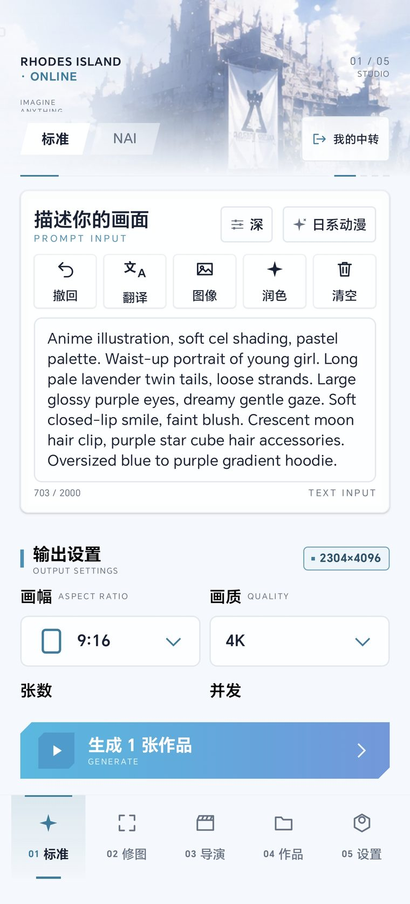
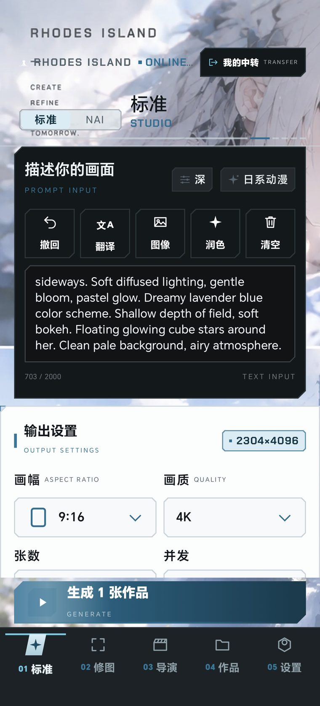
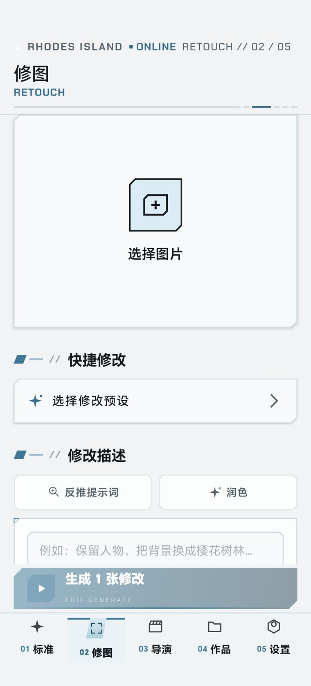
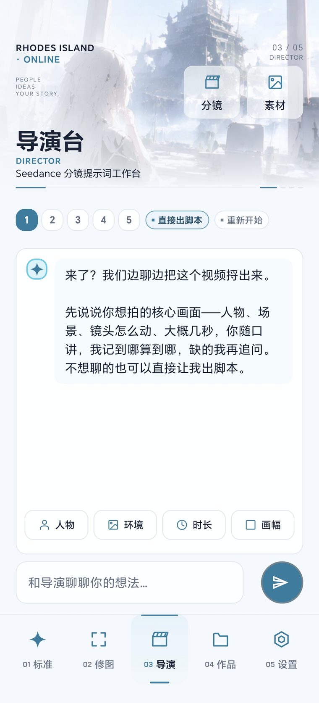
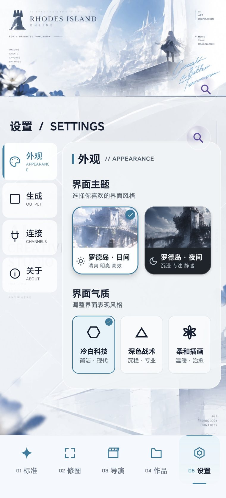
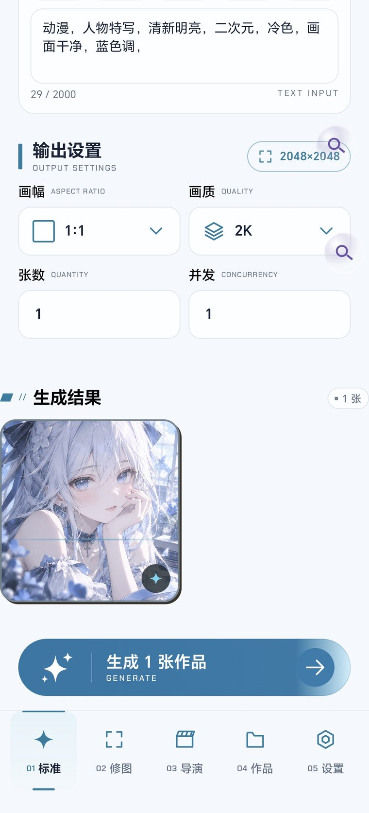
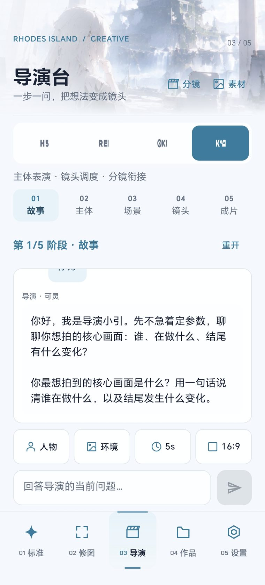

# 绘世 Imagine

一个 **Jetpack Compose** 编写的 Android AI 绘画工作台：标准绘图、NovelAI 原生工作台、ComfyUI 工作流、
图像修图、Seedance 视频分镜提示词，以及统一的「罗德岛终端」视觉主题。

- 应用名：**绘世**
- 包名：`com.lo.imagine`
- 最低版本：Android 7.0（API 24） · 目标版本：API 35
- 授权：MIT（见 [LICENSE](LICENSE)）

## 下载安装

**[⬇ 下载最新 APK](https://github.com/lzhhhhc/imagine/releases/latest)**（Debug 构建，用于功能体验）

1. 下载最新 Release 中的 `imagine-*.apk`
2. 允许「安装未知来源应用」后安装
3. 打开应用 → **设置 → 绘图引擎** 填写你自己的 API 地址与 Key

> 应用**不内置任何 API Key**，首次启动需自行配置。正式分发请自行配置 release 签名。

## 界面预览

| 标准绘图 | NAI 工作台 | 修图 |
| :---: | :---: | :---: |
|  |  |  |

| 导演台 | 设置 | 生成中 |
| :---: | :---: | :---: |
|  |  |  |

| 导演分步访谈 | 智绘姬角色导入 |
| :---: | :---: |
|  |  |

> 右侧截图即本项目对智绘姬（st-chatu8）导出格式的兼容导入功能，见下方借鉴声明。

## 功能

| 模块 | 说明 |
| --- | --- |
| 标准绘图 | 提示词输入与润色、风格/画质/画幅、批量张数、多路并发、结果入库 |
| NAI 工作台 | NovelAI 原生接口：模型/采样器/步数、角色卡与场景融合、token 估算 |
| ComfyUI 工作台 | 自建服务器/API 反代、工作流导入与参数绑定、任务恢复、多图原文件归档 |
| 修图 | 多参考图 + 逐图遮罩局部重绘、画质补齐、结果归档 |
| 导演台 | 与 LLM 逐步访谈生成 Seedance 分镜脚本，人物/环境素材库互通 |
| 作品库 | 生成历史浏览、预览、分享、继续编辑 |
| 设置 | 接口预设与模型选择、主题与气质切换、提示词模板、关于与制作人署名 |

## ComfyUI 快速开始

1. 在电脑上启动 ComfyUI，允许手机通过局域网访问；手机和电脑须处于可互通的网络。
2. 打开「创作 → ComfyUI → 服务器」，填写 `http://电脑IP:8188` 或 HTTPS 反向代理地址，测试并保存。可选 Bearer Key；设置页也能编辑同一连接。
3. 在电脑 ComfyUI 使用 **File → Export Workflow (API)** 导出节点 JSON。手机通过「选择工作流 → 导入文件 / 粘贴 JSON」导入。
4. 核对参数绑定和图片输出节点；简单工作流会建议提示词、seed、步数、尺寸等绑定，复杂图可手工绑定。普通画布格式须先重新导出。
5. 检查服务器节点与参数，点击「开始生成」。任务结果进入作品库，可预览、分享、存相册；停止等待后可恢复查询与补下载。

「停止等待」只停止手机端查询；服务器可能继续运行。提交结果待确认时请先确认任务或在电脑核对，避免重复出图。本版不切换其他绘图接口，不执行全局中断。RunningHub 适配接口已预留，尚未接入。

支持 PNG/JPEG/WebP 静态图片原文件；首版不含手机参考图上传、节点实时预览、视频/音频下载。详细范围、实现差异和验收记录见 [ComfyUI 实施记录](docs/COMFYUI_MODE_PLAN.md)。

## 视频 API 配置

在「设置 → 连接通道 → 视频 API」填写独立的基础地址、API Key 与模型 ID。支持新建空白预设、切换、重命名、删除及保存修改；输入自动保存，返回时立即写入。密钥默认隐藏，地址和 Key 格式错误会显示在对应字段下。

视频配置与绘图、润色 LLM、ComfyUI 分开保存。本版仅提供连接配置，尚未接入视频任务提交、查询或下载；导演台仍用于生成分镜提示词。模型 ID 按服务商文档手动填写。

## 主题系统

界面统一使用「罗德岛终端」设计语言，三个维度互相正交：

- **日夜模式**：`ARKNIGHTS_LIGHT` / `ARKNIGHTS_DARK`
- **气质（UiMood）**：冷白科技 / 深色战术 / 柔和插画 —— 只改轮廓与色调，不改日夜
- **圆角标尺**：全应用只允许 `PopRadius` 五档（10 / 12 / 16 / 20 / 胶囊），避免随手写圆角

图标为统一生成的 24 画布 / 1.7 线宽矢量字形，明暗共用同一份路径。

## 灵感来源与借鉴声明

本项目在 **NovelAI 工作台** 的设计思路上，明确借鉴了开源 SillyTavern 插件
**[damoshen123/st-chatu8（智绘姬）](https://github.com/damoshen123/st-chatu8)**：

**借鉴的部分（行为与交互设计，非代码）**

- NAI 原生接口的参数组织方式：`params_version` / 采样器 / 噪声调度 / `cfg_rescale` 等字段的取舍
- 角色卡（Character Prompt）的多角色分隔与「角色属性不互相污染」的处理思路
- 「角色数据 → LLM 推理 → 场景适配提示词」的场景融合链路设计
- 多角色人数与坐标字段的配合方式（`use_coords` 关闭时传空对象等对齐经验）
- 智绘姬导出格式（含 Base64 混淆字段）的兼容导入需求

**没有做的事情**

- **未复制其源代码**。本项目的解析器 `Chatu8CharacterImporter.kt`、NAI 客户端
  `NaiNativeClient.kt`、提示词处理 `NaiPolish.kt` 均为自行实现的 Kotlin 代码，
  仅以插件**公开的接口行为**为兼容目标。
- 其源码文件（`refs/st-chatu8/index.js` 等）**未纳入本仓库**，已在 `.gitignore` 中排除。

**为什么必须特别声明**

智绘姬依据 **Aladdin Free Public License (AFPL)** 授权，作者已明确说明
**AFPL 不是开源许可证**：允许免费复制修改再分发，但**禁止商业机构以任何收费方式分发**。
因此本项目严格保持「只借鉴思路、不搬运代码」的边界，避免许可证污染。
详见 [LICENSE](LICENSE) 的第三方声明段。

**致谢**：感谢 **从前跟你一样（[@damoshen123](https://github.com/damoshen123)）** 的智绘姬插件，
它在 NovelAI 多角色与场景融合上的探索为本项目提供了重要参考。

## 构建

需要 **JDK 17** 与 **Android SDK**。

```bash
# 首次：为 ARM64 环境准备 aapt2（脚本会自动替换 SDK 与 Gradle 缓存中的二进制）
chmod +x ./setup_android_env.sh
./setup_android_env.sh

# 编译 Debug APK 并运行单元测试
./gradlew :app:assembleDebug :app:testDebugUnitTest

# 产物
app/build/outputs/apk/debug/app-debug.apk
```

Windows 使用 `gradlew.bat`。

## 配置

标准/NAI API 地址与 Key 由应用内设置填写并保存在本机 DataStore。ComfyUI 连接独立保存在 `noBackupFilesDir`，不参与自动备份；工作流和任务记录在应用私有文件目录。应用不内置服务端地址或凭据。

## 文档

- [COMFYUI_MODE_PLAN.md](docs/COMFYUI_MODE_PLAN.md) —— ComfyUI 实施记录、能力边界与验收

- [NAI_WORKSPACE.md](NAI_WORKSPACE.md) —— NAI 工作台设计与状态机
- [NAI_ADAPTER.md](NAI_ADAPTER.md) —— NAI 原生接口适配层
- [ARKNIGHTS_THEME_REFACTOR.md](ARKNIGHTS_THEME_REFACTOR.md) —— 主题改造记录
- [MCP_DEVICE_BRIDGE.md](MCP_DEVICE_BRIDGE.md) —— 设备调试桥

## 制作人

**长乐未央** · Discode ID: 1466791961003294804