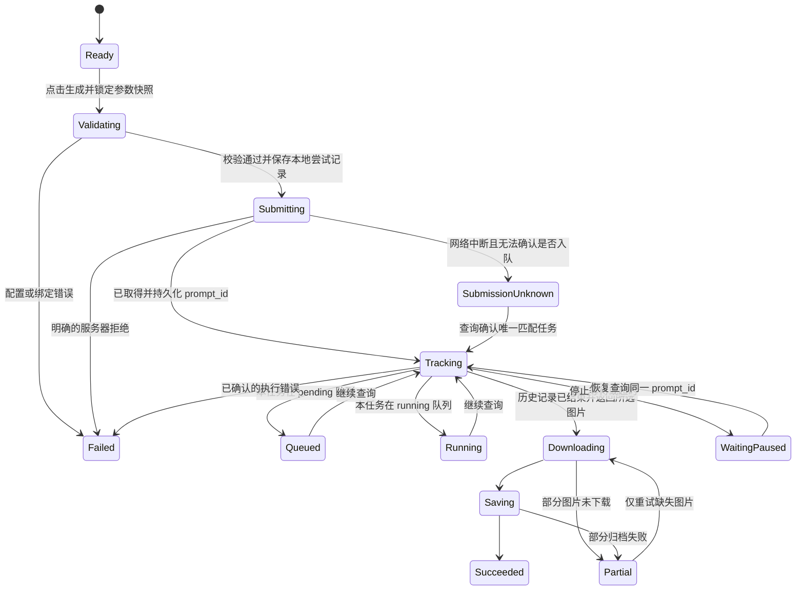

# 绘世 Imagine · ComfyUI 模式实施计划

状态：首版业务与界面代码已实现，自动化测试与真实服务器联调已完成；v1.2 本地安装包已生成。应用内视觉/操作和 Android 相册写入待用户验收，GitHub 发布因新凭据未就绪而暂停。第 14 节为实际交付记录；前文保留设计依据，未实现的细节以该节为准。

规划基线：2026-09-20，master `dc6d5bef11aba94323112f5429ffb3d83ac6e341`，应用 `1.1 / versionCode 2`。用户随后授权实施；实现与验证日期为 2026-09-20 至 2026-09-21，交付版本 `1.2 / versionCode 3`。

## 1. 目标与首版边界

将 ComfyUI 加入创作页第三种模式。用户在手机端完成：配置服务器 → 导入 API 工作流 → 核对可调参数 → 输入提示词并生成 → 查看、保存、分享作品。

产品定位是原生 Android 工作流运行客户端。模型推理、节点执行和显存消耗发生在用户自己的 ComfyUI 服务器上；手机提供表单、提交、任务查询和结果管理。

### 1.1 用户约束与本方案设计原则

- 模式选择包含「标准 / NAI / ComfyUI」。
- 使用应用已有 Compose 组件、主题、图标和弹窗语言；弹窗禁用黄色系选中态。
- 各模式保有独立的连接与生成参数。
- 新功能只走明确的 ComfyUI 请求路径，失败不切回标准或 NAI 接口。
- 按用户授权完成实现、构建与本地交付；新凭据就绪前不执行远端推送/发布。
- 后续完成改动后，应用内视觉和实际操作默认交给用户验收，不擅自切换应用验证。

### 1.2 建议纳入首版

| 能力 | 首版范围 | 明确限制 |
| --- | --- | --- |
| 模式切换 | 三档共享控件、统一导航、记住上次模式 | 底栏保留五项，建议第一项文案统一为「创作」 |
| 连接 | 一份独立 ComfyUI 连接，HTTP/HTTPS、可选 Bearer、测试连接 | 自建服务及保持原生 API 的反向代理 |
| 工作流 | 本地 JSON 文件导入、粘贴导入、多份保存、选择、重命名、删除、导出 | 接受 API 节点图，不转换普通画布 JSON |
| 参数绑定 | 常见节点识别建议、人工核对、保存绑定、按类型调参 | 不承诺自动理解所有自定义节点 |
| 生成 | 一次操作提交一个工作流任务；状态、耗时、图片下载 | 本机同一时刻只主动跟踪一个 ComfyUI 任务 |
| 状态恢复 | 持久化任务编号、恢复查询、补下载 | 重启手机或进程被杀后不承诺自动保活；重开应用可恢复跟踪 |
| 作品 | 多图片、预览、作品库、相册、分享、参数信息 | PNG/JPEG/WebP 静态图片，其他输出明确标识不支持 |

### 1.3 后续独立扩展

- WebSocket 节点进度和预览图；若引入，应独立定义事件与最终历史查询的职责。
- 多服务器档案、非 Bearer 的鉴权方式。
- Comfy Cloud、RunningHub 等不同协议的专用适配。
- 可视化节点编辑器、普通画布格式转换、工作流市场。
- 视频、音频、3D 等输出，以及任意复杂类型参数编辑。
- 已验证服务端版本的定向中断能力。

注：原列于此的「手机选参考图与 `/upload/image`、LoadImage 绑定」已在 v1.5 实现（见 14.6 节）。

首版可以运行已有服务器文件引用的工作流，但不会把这等同于已经支持手机端上传图片。自定义节点可原样提交给服务器，能否执行仍取决于服务端是否安装节点、模型与依赖。

## 2. 实施前核实的项目现状（历史基线）

| 现有位置 | 已确认情况 | 对计划的影响 |
| --- | --- | --- |
| `ui/ModeSwitch.kt:22` | StudioMode 只有 NORMAL/NAI；两项硬编码；48dp 点击高度 | 改成一个三模式定义，三个页面共用 |
| `ui/AppState.kt:185` | NaiModeState 只是进程内 Boolean，进程退出即忘记 | 替换为明确的当前模式，不保留布尔控制分支 |
| `ui/ImagineApp.kt:135,201,217,222,284` | 滑动、导航、底栏、背景、页面注册分别特殊处理 nai | 必须一起改，不能只加一个路由 |
| `ui/ImagineApp.kt:190` | AppBus 直接导航，与底栏导航是不同入口 | 区分「返回上次创作模式」和「显式进入指定模式」 |
| `ui/UiKit.kt:152` | 页头把模式条与右侧操作放进同一 Row；hero 高度受限 | 三档后需要自适应换行并调整页头高度 |
| `ui/studio/NaiWorkspaceScreen.kt:349` | NAI 页头还有额外 32dp 测量补偿 | 统一页头时核对实际父约束，不复制偏移补丁 |
| `data/AppSettings.kt:111` | SettingsRepository 使用 Preferences DataStore | 小型配置沿用，工作流与任务大对象另存私有文件 |
| `data/GenerationService.kt:153` | 进程级任务入口与前台服务可复用，launch 当前不返回 Job | 接入可取消的跟踪任务，避免 UI 协程拥有长任务 |
| `util/ImageUtils.kt:21,247` | 历史只保存提示词、模型、类型、时间；当前列表只枚举 PNG | 扩展可选 Comfy 元数据和原文件归档 |
| `ui/AppState.kt:22` | 预览状态未携带工作流元数据 | 历史、翻页和预览详情需要同步传递 |
| `AndroidManifest.xml` | 已有网络、前台服务和明文 HTTP 配置 | 无需为局域网访问再引入广泛存储权限 |
| `app/build.gradle.kts` | 已有 OkHttp 4.12、Gson、DataStore、Coil | 复用网络与序列化基础，不引入第二套网络栈 |

重要经验：此前导演台双入口不互通来自两个独立快照。本模式的页面、连接弹窗和设置入口必须订阅同一个 Repository 状态，不自行读取并维护第二份配置。

## 3. 用户体验与页面构思

### 3.1 导航规则

- 三个创作页面都使用同一份模式定义与切换条。
- 手动选中模式时，先记录新模式，再跳到其明确路由。
- 从作品、设置等底栏页面回到「创作」时，打开上次选中的模式。
- AppBus 等指定模式的动作按其明确意图处理，不能被模式记忆强行改写。
- 三个创作路由统一映射到底栏第一项、创作背景与相同滑动顺序。
- 最近模式保存到本地，冷启动先恢复模式选择；首次安装没有记录时以标准模式开始。
- 配置读取失败显示错误和重试，不能让默认配置覆盖原有存储。
- 切到其他模式不取消正在跟踪的 ComfyUI 任务；返回后显示同一个任务。

### 3.2 主页面信息顺序

```text
既有创作页主题背景与页头
[ 标准 | NAI | ComfyUI ]              [服务器]

[ 当前工作流名称                    ▾ ]
  已绑定 7 项参数 · 1 个图片输出

画面提示词
[ 多行输入                         ]
负面提示词                         展开

生成参数                           展开
  1024 × 1024 · 24 步 · CFG 5 · 随机种子
  批量 1（仅工作流已绑定 batch_size 时可调）

[ 开始生成                          ]
  排队 / 执行 / 下载 / 保存 · 已耗时
  [停止等待] 或 [移除排队任务]

本次结果
[ 图片 ] [ 图片 ]

[ 创作 | 修图 | 导演 | 作品 | 设置 ]
```

这只是信息结构，不是新配色或视觉稿。沿用现有生成按钮、输入框、卡片与作品缩略图样式。

### 3.3 小屏与主题细节

- 模式条保留完整「ComfyUI」文案；不靠缩小字号或压低触摸高度塞入。
- 按实际可用宽度与字体大小测量。模式条和右侧入口放不下时，右侧入口下移一行，页头增加对应高度。
- 常规手机以单行页头为目标；320dp 小屏和大字体以换行保证完整可用。
- 模式选中态复用 `primaryContainer/onPrimaryContainer`；表面复用 `surface`、`outlineVariant`；不增加独立品牌配色。
- 弹窗采用既有主题底色、墨线描边与标题行，选中态无黄色。
- 图标复用现有矢量图标家族；必要新增的节点连接图标需匹配线宽、比例与留白。
- Android 点击区域至少 48dp；装饰图标不重复朗读，模式选择提供 selected/tab 语义。
- 长工作流名显示省略，打开列表可查看全名；地址和 Key 不放入页头。
- 固定生成区域、底栏与输入法之间保留正确 inset，错误文案不被键盘遮住。
- 测试范围覆盖明暗主题、已有界面气质、320/360/412dp、横屏、1.0/1.3/2.0 字号比例。

### 3.4 初次使用与空状态

1. 未设置连接：显示「连接你的 ComfyUI」卡片，填写地址与可选鉴权，测试并保存。
2. 未导入工作流：显示两个入口「导入 JSON」「粘贴 JSON」，旁边解释 API 导出路径。
3. 导入后：显示工作流名、节点数量、可调参数建议和输出节点，用户核对后保存。
4. 已就绪：主页面只保留常用表单，原始节点与 JSON 放进工作流管理页。
5. 未绑定参数的有效工作流：允许明确选择「按工作流原值运行」，不显示实际不会生效的控件。

输入错误就近显示；多项失败提供可定位的错误摘要。测试连接、导入校验、提交均有明确的处理中和完成反馈。

### 3.5 连接与工作流的两个入口

- 右上角短胶囊表示「服务器」并显示连接状态。
- 页头下第一行是工作流选择器，管理名称、参数绑定和导入导出。
- 「设置 → 连接」增加 ComfyUI 行，打开与工作台相同的连接编辑组件。
- 连接编辑使用同一配置源；保存后两个入口立即同步。
- 表单编辑采用显式保存/取消；生成参数草稿可防抖自动保存，写入任务不归弹窗生命周期拥有。

## 4. 工作流格式与参数绑定

### 4.1 首版输入契约

接受 ComfyUI「File → Export Workflow (API)」导出的节点字典。每个节点包含 `class_type` 与 `inputs`；节点 ID 按字符串处理，不强制假定都是纯数字。

普通画布 JSON 常见 `nodes` 数组、`links` 与位置数据。识别到此格式，保留原文件不入库，并提示在 ComfyUI 中加载后重新导出 API 格式。首版不尝试转换，也不依次猜测多种封装。

仅接受直接节点图；完整 `/prompt` 请求封装、PNG 内嵌工作流和 ZIP 不在首版导入契约内。

文件由系统文档选择器读取，复制进应用私有存储。提议限制为 5MiB、5000 节点，并对深度异常的 JSON 给出可解释错误；实现时用真实样例检验限制，避免主线程解析或无限制加载。

本地校验包括：语法、非空节点图、节点类型和 inputs 结构、可识别连线目标存在、绑定目标类型正确、已知图片输出存在或由用户明确选择。未知自定义节点不因不认识名字就直接删除或改写。

### 4.2 采用一套绑定执行机制

推荐流程：读取节点图 → 生成参数候选 → 用户核对 → 保存显式绑定 → 每次提交按绑定写入 JSON 树。

**首版不把 `{{prompt}}` 等占位符作为另一个运行协议。** 用户不必手改 JSON 来接入表单；识别和手动选择最终都生成同一种绑定记录，运行时不再重新猜节点。

| 表单字段 | 常见候选 | 绑定规则 |
| --- | --- | --- |
| 正向提示词 | CLIPTextEncode.text | 从采样器 positive 连线寻找明确的文本输入，不按节点排列顺序猜 |
| 负面提示词 | CLIPTextEncode.text | 从 negative 连线寻找；共享同一个文本目标时必须提示冲突 |
| 种子 | KSampler.seed；KSamplerAdvanced.noise_seed | 保留确切字段与数值类型，不把所有 seed 同时改掉 |
| 步数 | KSampler/KSamplerAdvanced.steps | 多采样器时展示候选，用户决定对应阶段 |
| CFG | KSampler/KSamplerAdvanced.cfg | 只在存在且绑定后显示；不假定所有模型采用同一 guidance 语义 |
| 宽高 | EmptyLatentImage 等明确支持的 width/height 输入 | 不统一强套 64 对齐；尊重节点约束 |
| 批量 | 明确节点的 batch_size | 与本地请求次数区分，未绑定时显示「由工作流决定」 |
| 进阶参数 | sampler_name、scheduler、denoise、ckpt_name 或人工选定的标量 | 枚举优先由服务器节点元数据提供 |

- 可识别的简单直连图给出候选建议，仍在导入确认页展示；遇到合并 conditioning、SDXL 双编码、自定义采样链等歧义，要求选定目标或保留工作流原值。
- 参数可以明确绑定多个目标，例如用户希望同时修改两个文本编码器；界面列出每个目标，不能默认全图替换。
- 同一目标输入被不同参数占用属于冲突，保存前阻止。
- 连线数组与普通文本/数值区分；不能把本来连到上游节点的输入直接覆盖成常量。用户应绑定其上游标量，无法表达时到 ComfyUI 调整。
- 普通表单只显示已绑定且可以生效的参数。自定义复杂数组/对象保留原值，首版不生成任意嵌套表单。
- 导入图中的初始参数就是默认值，不擅自替换用户原有采样器、尺寸或模型。
- 工作流更新后重新校验绑定；失效绑定明确列出并暂停提交，不自动寻找“差不多”的节点替代。

### 4.3 数值与 JSON 处理

- 使用 Gson JsonElement/JsonObject 深拷贝后定点写入，不使用整段字符串替换。
- 用户输入的引号、换行、反斜线与中文由序列化器处理。
- seed 不经过 Double，避免大于 2^53 的整数精度丢失；根据服务端范围使用可精确表达的整数/BigInteger。
- 「随机种子」是 UI 模式，提交前生成实际非负整数，并记录到任务快照；不把 -1 原样发送给不支持它的节点。
- 不猜测多张图片内部的 seed 递增方式，只记录实际提交值与服务端确实提供的信息。
- 数字合法性、枚举、范围与步长以节点元数据为依据；对未知约束给出有限的本地检查，最终由 `/prompt` 校验。
- 原始工作流保持不变。任务快照、请求图和后续正在编辑的草稿互不覆盖。

### 4.4 工作流管理

首版支持保存多份工作流；每份独立保存绑定和参数草稿。导入同名文件不会悄悄覆盖已有内容；新增记录使用独立 ID。替换已有工作流是明确的更新操作，并重新核对绑定。

删除本地工作流不删除服务器任务或已归档图片。正在运行的任务继续使用其不可变快照。

导出为当前可执行的 API 节点图，由系统文档创建器选择位置。应用连接鉴权不写入工作流；用户自行导入的原节点内容可能包含私有信息，应用不自动上传到任何工作流市场或第三方。

## 5. 连接与协议

### 5.1 连接配置

首版字段：连接名称、Base URL、鉴权模式（无 / Bearer）、凭据、可调整的最长等待时间。

- 示例地址 `http://192.168.1.10:8188`；手机的 localhost 指手机本身，不代表电脑。
- 支持反向代理前缀，例如 `https://example.com/comfy/`，路径拼接保留前缀。
- 不补 `/v1`，不复用标准/NAI 的地址、Key 或模型预设。
- Base URL 只接受明确的 HTTP/HTTPS 地址；拒绝 URL 内嵌用户名密码、query token 与 fragment，鉴权放独立字段。
- HTTPS 使用系统证书校验，不增加“信任所有证书”。
- 不自动跟随跨来源或降级重定向；遇到代理跳转，让用户填写最终 API 地址。
- 凭据保存在应用私有配置；日志、调试摘要、任务普通元数据和自动备份应排除凭据。新增凭据存储文件单独排除备份，不借本功能整体重构旧凭据存储。
- 连接状态与配置指纹关联，修改地址或鉴权后立即失效，不能沿用上一个地址的“已连接”。

### 5.2 接口职责

| 接口 | 用途 | 校验与约束 |
| --- | --- | --- |
| `GET /system_stats` | 测试连接，取得服务器版本等基本信息 | 200 HTML 登录页不算连接成功；检查 JSON 结构 |
| `GET /object_info/{node_class}` | 获取工作流用到的节点类型、输入枚举与约束 | 只查需要的类型并缓存，按连接区分；不假定前端模型列表就是标准 API 模型列表 |
| `POST /prompt` | 提交 `{prompt, client_id}` | 成功取得 prompt_id 立即持久化；处理 error/node_errors |
| `GET /history/{prompt_id}` | 查询该任务最终状态、输出、执行错误 | 空对象不等于失败；失败状态也可能带部分输出 |
| `GET /queue` | 区分该任务排队/运行 | 只读取本机记录的 ID；不把全服务器 queue_remaining 当自己的进度 |
| `GET /view` | 根据 filename/subfolder/type 下载图片 | 参数 URL 编码，同连接鉴权，不采信任意外部下载 URL |
| `POST /queue` | 用户明确要求移除当前待执行任务 | 请求只包含 `delete: [本任务 ID]`，禁止 clear |

`number` 是队列编号，不是持续准确的“前面还有几人”。动态状态通过匹配 queue 中的 prompt_id 判断。

如果 `/prompt` 已返回 prompt_id 同时附带 node_errors，应保留已接受任务并展示校验问题，不能当作“未提交”再自动提交一次。服务器对可执行输出的判断具有最终效力。

### 5.3 首版进度方案

采用一条固定 HTTP 跟踪链：提交 → history 查询，结合 queue 区分排队/执行 → view 下载 → 本地归档。

- history 建议每 2 秒一次，queue 每 5 秒一次；请求可取消，不在主线程阻塞。
- 默认连接超时 10 秒，普通请求 30 秒；图片下载单独设置合理读取/整体上限。
- 主动跟踪等待上限默认建议 30 分钟，可设置。超时后保留任务记录，显示「等待已暂停」，不声称 GPU 任务已经结束。
- 不显示虚构的采样百分比。执行阶段显示文字与耗时；下载可用明确字节总量显示真实进度，否则显示已下载大小或图片数量。
- 网络读取暂时失败可在同一接口做最多 3 次有间隔重试；401/403、格式错误直接提示。之后暂停跟踪，等待用户恢复。
- 非幂等的 `POST /prompt` 禁止应用自动重发，并关闭可能透明重发的客户端配置；排队删除也先对账，不盲目重复操作。
- 不切备用服务器、不切旧绘图接口、不换鉴权方案。失败原因在当前路径显示。

## 6. 任务生命周期、取消与恢复

### 6.1 状态机



状态机图省略了“移除排队任务”和“任务历史丢失”的细分支，以下规则是完整契约。

### 6.2 防止重复生成

1. 点击生成的原子入口先取得互斥权，重复点击不能启动第二个提交。
2. 生成时冻结连接、工作流版本、绑定、实际参数与实际 seed。
3. 提交前创建本地 jobId 和本次专用 client_id，持久化“准备提交”记录。
4. 成功响应后首先持久化 prompt_id，再开始查询与下载。
5. POST 发送后超时、连接断开或收到无法确认的响应，标记“提交结果待确认”；不自动再发 POST。
6. 可以由用户触发查询 queue/有限范围 history，按本次 client_id 对账。只有唯一且可验证的匹配才恢复任务；没有查到不等于从未提交。
7. 用户选择再次生成是创建一个明确的新任务；界面说明旧任务状态仍未知。

首版不依赖新版服务器才有的客户端自选 prompt_id 功能；即使未来使用，也不能把它未经验证地当成幂等保证。

### 6.3 停止与移除

- 排队时提供「移除排队任务」：只删除保存的本任务 ID，随后查询确认结果。
- 删除时若任务已开始运行，提示服务器仍在执行；响应 200 不能单独证明取消成功。证据不足显示状态待确认。
- 执行时首版提供「停止等待」：取消手机端查询/下载，保存进度与 prompt_id；文案明确服务器可能继续运行。
- 支持「恢复查询」与「补下载」；不重新提交工作流。
- 用户停止等待应显示中性结果通知，不伪装成服务器执行失败。
- 不调用全局 `/interrupt`，不清空服务器队列。

版本说明：已阅读的上游版本支持在 `/interrupt` 中传 prompt_id，但旧服务端可能忽略该字段并执行全局中断。因此首版不以“发送一个 ID 就一定安全”作为假设；定向中断另行建立版本/能力契约后再引入。

### 6.4 切页、后台与进程死亡

- 任务归进程级 Coordinator / GenerationService 生命周期拥有，页面只订阅状态。
- 配置变更只影响下一次任务；在途任务继续使用原快照。
- 复用已有前台服务，在系统允许时保持后台查询和下载；服务启动受限时明确显示跟踪受限，不能承诺永久后台运行。
- 拿到 prompt_id 后，即使应用重启，仍可查询既有任务。恢复记录但不自动重新 POST。
- 服务端历史清空、重启或临时图片丢失时，显示“任务/结果暂不可查询”，不无限转圈或假报成功。
- 更换连接地址后，旧任务不会向新地址查询或发送新 Key。恢复操作要求配置与任务所记录来源匹配。
- 原凭据只在内存请求快照和私有配置存在，任务日志保存凭据引用而非复制明文。

## 7. 结果、作品库与参数记录

### 7.1 图片选择与下载

- 在工作流导入页选择图片输出节点。单个明确的 SaveImage 输出可建议选中；多个输出必须清楚列出。
- 不把中间预览、不同阶段的 SaveImage 和最终图静默混成一批。
- 以所选节点实际 history.outputs.images 为准；记录 `(nodeId, filename, subfolder, type)`，去除完全重复的文件引用。
- 不能假定请求 batch_size=N 就必然只返回 N 张；页面显示“请求批量”和“实际返回数量”。
- 没有可下载图片的成功任务显示“执行完成，但所选输出没有图片”，不抛空列表异常。
- 执行失败但含部分输出时，保留错误状态，允许查看有效图片，不改成整体成功。
- 静态图片以服务器原文件保存；不复用标准模式的尺寸补齐/裁切逻辑，避免更改工作流真实产物。
- 先写临时文件，验证实际文件格式、解码尺寸和可用性，再进入作品库；下载中断不留下半张可见作品。
- 文件名使用本地 jobId + 输出标识摘要，远端 filename 只用作 `/view` 参数，不能用于拼接本地路径。
- 内存展示缩略图与有限预览缓存，多张大图不永久保存成 Bitmap 列表。

### 7.2 元数据与幂等保存

在既有 HistoryMeta 上新增可选的 Comfy 元数据：来源模式、工作流名称/ID/版本摘要、prompt_id、本地 jobId、实际提交 seed、绑定参数、选定输出节点、实际图片尺寸。

- 旧作品没有新字段仍正常读取，这是历史文件结构的向后可读性，不是请求失败后回退旧接口。
- 完整请求快照放私有任务记录，普通作品详情只读取需要的字段，不展示完整网络响应或凭据。
- 多阶段/多模型图不能随便把第一个 checkpoint 当成唯一模型；已确认的单模型显示名称，否则显示工作流名称。
- 批内图片以稳定输出键归档；恢复下载不能重复写入作品库或系统相册。
- 若相册写入失败而私有作品已经保存，保留作品并提示单项结果，用户可之后手动保存。
- 若本地存储不足，保留可恢复任务与已保存的图片，不显示“全部完成”。
- 历史列表扩展 PNG/JPEG/WebP；预览、翻页、删除元数据与保存分享保持现有行为。
- 首版详情支持查看/复制参数；完整“从任意历史一键重建环境”不在保证范围内，因为服务端模型和节点可能已变化。

## 8. 数据与代码分工

### 8.1 建议数据模型

| 模型 | 主要内容 | 归属 |
| --- | --- | --- |
| StudioMode | route、label、创作路由集合 | 共享导航定义 |
| ComfyConnectionConfig | ID、名称、规范化地址、鉴权类型、凭据引用、等待上限 | 独立连接配置 |
| ComfyWorkflow | schemaVersion、ID、名称、原图、图摘要、绑定、草稿、输出选择 | 私有工作流文件 |
| WorkflowBinding | 参数名、目标 nodeId/inputName 列表、数据类型与可验证约束 | 工作流的一部分 |
| ComfyGenerationSnapshot | 提交时连接来源、工作流版本、实际参数和请求图 | 不可变任务快照 |
| ComfyJobRecord | jobId/clientId/promptId、状态、起止时间、输出与保存记录 | 持久化任务文件 |
| ComfyImageRef | nodeId、filename、subfolder、type、输出键 | 远端结果引用 |
| ComfyUiState | 配置加载态、当前工作流、任务状态、结果文件、错误 | Repository/Coordinator 的可观察状态 |

### 8.2 存储规则

- Preferences DataStore：最近创作模式、当前工作流 ID、小型配置与草稿索引。
- 工作流：`filesDir/comfy/workflows/{id}.json`，单个版本化记录包含图、绑定、名称与草稿，原子更新。
- 任务：`filesDir/comfy/jobs/{jobId}.json`，先落提交记录，再记录 prompt_id 和结果，重要状态变更立即落盘。
- 连接凭据：独立私有配置存储并排除自动备份；任务与作品仅引用配置身份。
- 文件解析与读写在 IO 线程。记录损坏时保留原文件并显示错误，不清空整个工作流库。
- 单一 Repository 写入入口；对一个字段的保存不覆盖其他未关联字段。
- 生命周期感知收集状态；若采用 collectAsStateWithLifecycle，补充与现有 lifecycle 版本匹配的 runtime-compose 依赖，不顺手升级全套依赖。

### 8.3 建议文件清单

| 新增或修改 | 责任 |
| --- | --- |
| 新增 `data/comfy/ComfyModels.kt` | 配置、任务、输出、错误类型 |
| 新增 `data/comfy/ComfyWorkflowEngine.kt` | API 图解析、绑定候选/校验、请求图构造 |
| 新增 `data/comfy/ComfyClient.kt` | 严格 URL、鉴权、HTTP 请求与响应解析 |
| 新增 `data/comfy/ComfyRepository.kt` | 连接、工作流、任务日志的单一数据源 |
| 新增 `data/comfy/ComfyTaskCoordinator.kt` | 去重提交、轮询、恢复、取消等待、输出归档 |
| 新增 `ui/studio/comfy/ComfyWorkspaceScreen.kt` | 主工作台与状态反馈 |
| 新增 `ui/studio/comfy/ComfyWorkflowEditor.kt` | 导入、参数映射、输出选择与库管理 |
| 新增 `ui/studio/comfy/ComfyConnectionDialog.kt` | 设置与工作台共用连接表单 |
| 修改 `ui/ModeSwitch.kt`、`ui/AppState.kt` | 三模式定义，替换 NaiModeState |
| 修改 `ui/ImagineApp.kt`、两份既有 Studio Screen | 泛化选择回调、路由、底栏、背景与滑动 |
| 修改 `ui/UiKit.kt` 或提取共用 StudioHeader | 模式条/右侧操作自适应、Comfy 页头编号 |
| 修改 `data/AppSettings.kt` | 最近模式与必要的独立配置接入 |
| 修改 `ui/settings/SettingsScreen.kt` | 连接区新增 ComfyUI 入口 |
| 修改 `data/GenerationService.kt` | 返回可管理的 Job，区分停止等待和失败通知 |
| 修改 `util/ImageUtils.kt` 与相关预览/历史状态 | 原文件归档、多格式列表、可选工作流元数据 |
| 修改 backup 规则及必要依赖配置 | 排除新增凭据文件；增加必要的测试/生命周期依赖 |
| 新增 Comfy 测试与原创 fixtures | 工作流与 HTTP 行为测试 |

文件可在实施中按职责合理合并，不能把完整网络/持久化逻辑塞进单个 Composable，也不为此重写标准和 NAI 的生成引擎。

## 9. 分阶段实施与完成条件

| 阶段 | 工作 | 可检查产物与完成条件 |
| --- | --- | --- |
| P0 契约与样例 | 固定首版边界、状态定义、构造原创测试图 | 简单文生图、多采样器、多个输出、未知节点、错误格式样例；不得搬入 AFPL 参考代码 |
| P1 模式与配置基础 | 三模式路由、模式记忆、单一 Repository、私有文件结构 | 标准/NAI 双向切换仍正常；切离回到 Comfy；冷启动恢复，不串配置 |
| P2 工作流引擎 | 导入、格式辨识、绑定建议/编辑、类型校验、JSON 写入 | 多阶段图不误绑；seed 精确；未绑定输入不被改写；原始图保持不变 |
| P3 网络与任务 | 连接测试、节点信息、提交、查询、下载、停止等待、恢复日志 | MockWebServer 完整模拟成功/错误/断线；每次生成最多一个提交 |
| P4 原生工作台 | 主题内主页面、工作流库、共用连接弹窗、可见状态 | 小屏/大字布局规则落实；配置两入口互通；只有有效参数可编辑 |
| P5 作品整合 | 原文件落盘、可选元数据、预览/历史、相册与部分失败 | 多图完整；恢复不重复；旧作品正常；真实输出尺寸不变 |
| P6 集成与验收 | 全量构建测试、用户操作清单、真实服务器联调（如有） | 自动化证据、用户视觉结果、真实服务器结果分开记录 |
| P7 发布 | 版本自增、更新说明、APK 与源码、Release 校验 | 经既有发版流程发布；记录具体支持范围与尚未验证项 |

依赖关系：P1 为集成基础；P2、P3 的纯逻辑可以分别推进；P4 依赖状态/绑定契约；P5 接入任务结果；P6 通过后才进入 P7。

不以一个空模式页作为本功能完成。首版完成标准是“有用的工作流能完整提交并把结果归入作品库”，同时处理明确列出的异常。

## 10. 测试与验收矩阵

### 10.1 纯逻辑测试

| 领域 | 必须覆盖的行为 |
| --- | --- |
| 导入 | 有效 API 图、空图、语法错误、普通 nodes/links 画布、超限、保留未知节点 |
| 绑定 | positive/negative 不颠倒、多采样器歧义、共享目标冲突、连线输入不能被误替换 |
| JSON | 引号/换行/反斜线、Unicode、超 2^53 seed、数值/字符串类型、原始图不变 |
| 参数 | 随机 seed 固化、无 batch 绑定不宣称可改数量、schema 范围/枚举校验 |
| 导航 | 三模式显式选择、底栏返回记忆、滑动目标、预览返回、冷启动加载竞争 |
| 存储 | 编辑中断/失败、损坏记录保留、单字段并发更新、两入口同步、旧作品可读 |

### 10.2 HTTP 与任务行为测试

建议使用与 OkHttp 4.12.0 配套的 MockWebServer；测试真实请求路径、请求体与状态转换，不只检查源码中存在某个字符串。

- 基础地址含路径前缀、query URL 编码、无鉴权/Bearer、401/403、200 HTML、非法 JSON、重定向。
- 连接测试不提交工作流；节点缺失/模型缺失给出可定位信息。
- `/prompt` 正常返回、400 节点错误、已接受但附 node_errors、POST 后响应丢失。
- 提交不透明重试，重复点击不二次提交；unknown 状态不能被当成未提交。
- history 空 → pending → running → completed；history 失败状态、无图片、部分输出、多个图片输出。
- query 断线后仍围绕同一 prompt_id 恢复；取消请求真正释放 Call/协程。
- 删除排队项只包含本机记录的 ID；不出现 clear 或全局 interrupt。
- 文件下载鉴权、错误内容类型、损坏图片、超时、部分失败、补下载不重复提交。
- 归档键幂等、磁盘失败、多个图片同一时刻保存不碰撞、历史 JSON 不含连接 Key。
- 进程恢复时已知任务继续查询；更换服务器后旧任务不会发给新来源。

### 10.3 用户界面验收

1. 标准 → NAI → ComfyUI 三向切换；到作品/设置再回创作仍是 ComfyUI。
2. 页头小屏不重叠，右侧入口与模式条材质一致；明暗弹窗都不出现黄色选中行。
3. 连接页与设置页修改同一配置，返回后立即一致。
4. 文件导入、粘贴导入均能保存；误导入普通工作流时有具体导出指导。
5. 多采样器图不会“猜一个就开跑”；参数绑定可查看修改目标。
6. 参数输入、展开折叠、键盘弹出、字号放大不遮住生成/错误信息。
7. 生成中切页与返回，任务编号和结果保持；停止等待后可恢复。
8. 多图结果能预览、存作品库/相册和分享；实际尺寸不被裁切或补齐。
9. 旧标准/NAI 生成、预设、修图张数、导演素材同步、应用更新功能回归。

### 10.4 验证证据的边界

- 本轮已取得可访问的原生 ComfyUI 服务器；真实出图与应用内 UI 验收分开记录。
- 无真实服务器时，可以验证客户端 HTTP 行为、状态机、存储与构建；不能写“ComfyUI 真机出图已通过”。
- 有实际可用 API 工作流和服务器后，再验证模型/自定义节点差异与真实 GPU 任务。
- 默认不自动启动或切换用户应用验 UI，交付具体验收路径。若用户后来明确要求自行检查反复问题，则利用已授权的日志等证据定位。
- 不建立额外“验证配置台”；测试使用进程内 HTTP 模拟与正常业务入口。

## 11. 发布计划与现有脚本注意点

若没有其他版本抢先发布，目标版本建议 `1.2 / versionCode 3`；实际发布前按最新本地与 Release 状态选择严格递增版本，不能覆盖当前 v1.1 附件作为本次功能升级。

沿用 `tools/release.sh` 的职责：版本自增 → 构建与全量测试 → 提交推送 → 创建 Release/上传 APK → 核对 latest、文件大小、签名与哈希 → 按需安装。

实施前发现的发布门禁缺口如下；本轮已修正并以隔离的伪命令验证失败退出行为，实际远端发布仍未执行：

- 版本检查改为数字点分版本严格递增，拒绝相等（含 1.1 与 1.1.0）和降级。
- 提交、推送、Release 创建和附件核对任一失败立即退出，不输出成功。
- 单测汇总要求报告存在且有实际执行测试，拒绝 0 项、全跳过和失败报告。
- `--install` 将 APK 导出共享目录，明确交由 Android shell 安装；脚本不会假报已安装。助手需要继续在 Android shell 执行安装并核对结果。本轮未安装或启动应用。
- APK 签名和已安装版本单独核对；本地产物记录 SHA-256。增加显式 `--local-only`，它在打包后退出，不读取 GitHub 凭据，也不因发布失败自动进入该模式。

正式发版使用此前已经授权的流程，不重复索要常规发布许可。已有对话中公开的 GitHub 凭据视为泄露，不能继续用它推送或发布；应使用安全重新认证后的凭据。若当时没有可用的新认证，完成本地代码、测试、APK、更新说明后明确标记远端发布受阻，而不是宣称已上线。

发布说明应包括：新增入口、工作流 API 导出方式、支持的鉴权和输出格式、参数绑定机制、停止等待语义、真实服务端测试范围。

## 12. 建议默认决策与待补充信息

| 项目 | 本计划采用的建议默认值 | 何时需要更多信息 |
| --- | --- | --- |
| 工作流来源 | 用户选文件或粘贴 API JSON | 用户若要固定模板库，可后续扩展，不阻塞首版 |
| 参数方案 | 导入时识别建议 + 人工核对 + 保存显式绑定 | 真实复杂工作流可用于确认常见节点覆盖面 |
| 接口范围 | 自建 ComfyUI 原生 API / 同协议反代 | 使用某个云平台时需单独核实该平台 API |
| 鉴权 | 无 / Bearer | 确有 Basic、Cookie、专用 Header 需求时再设计 |
| 进度 | 固定 HTTP 查询与阶段信息 | 需要逐步进度/预览时再引入 WS |
| 取消 | 移除本任务待执行项 / 停止本地等待 | 服务端定向中断需证实版本能力 |
| 数量 | 一次提交一个工作流任务；批量由已绑定工作流输入决定 | 多请求批次调度作为独立能力评估 |
| 模式记忆 | 保存上次创作模式，底栏建议称「创作」 | 可根据用户后续偏好调整文案 |
| 实测 | 先自动化协议测试，再真实服务器出图 | 地址、可用工作流与实际模型决定联调范围 |

这些默认值用于让计划可执行，不表示用户已经逐项确认。真实工作流样例和服务器地址在联调阶段最有价值，现在不必为规划重复提交三轮确认。

## 13. 依据与资料

- 当前工作区实际读取的文件与行号见第 2 节。
- [ComfyUI 官方服务端路由](https://docs.comfy.org/development/comfyui-server/comms_routes)：prompt、history、queue、view、object_info 等职责。
- [ComfyUI 官方 API 工作流格式](https://docs.comfy.org/development/api-development/workflow-api-format)：普通保存格式与 API 格式区别，导出路径。
- [ComfyUI 官方 WebSocket 消息](https://docs.comfy.org/development/comfyui-server/comms_messages)：用于划清阶段状态与节点进度的能力边界，首版不实现 WS。
- [已核实的上游 server.py](https://github.com/Comfy-Org/ComfyUI/blob/3dd559d81f745747cab884a3b9f5fd8867d79efe/server.py)：核对 POST prompt、history、queue delete、带 prompt_id 的 interrupt 现状；不能外推为所有已部署版本支持。
- `ui-ux-pro-max` 的 Jetpack Compose 状态/生命周期及表单反馈规则：只采纳与本应用相关的建议，视觉以绘世已有主题为准。

## 14. 实际交付与验证记录

### 14.1 已实现

- `data/comfy` 六个文件：数据模型与 `WorkflowBackend` 边界、工作流解析与绑定、HTTP 客户端、原子文件存储、任务协调器、Android 运行时归档。
- `ui/studio/comfy` 三个文件：原生工作台、共享服务器弹窗、工作流库与绑定编辑器。标准/NAI/ComfyUI 统一导航、创作底栏、背景和模式记忆已接入。
- API 图导入（最大 5 MiB / 5000 节点 / 64 层）、标量绑定、歧义不自动选择、整数与 seed 精度、服务器节点/枚举/范围检查、输出节点选择。
- 单次提交、提交前落盘、取得 prompt_id 立即保存、UNKNOWN 对账、防重复提交、停止等待、恢复查询、定向移除排队、逐图下载/补下载。
- PNG/JPEG/WebP 原图归档，作品库/预览/参数详情对接；Android 相册采用稳定文件名与待写入记录恢复。
- 损坏的连接、工作流库或任务记录保留原文件，阻止未加载状态下覆盖和提交；数值输入尚未完成的草稿仍可重开继续编辑。
- 连接凭据在 `noBackupFilesDir/comfy-connection.json`；普通任务与作品元数据不含连接凭据。

### 14.2 与最初方案的明确差异

| 项目 | 本版实际实现 / 后续工作 |
| --- | --- |
| 工作流存储 | `filesDir/comfy/library.json` 原子写入一份库，最多 50 份；当前选择与草稿放在同一库。任务仍逐项存入 `comfy/jobs/{id}.json`。 |
| 连接档案 | 一份 URL + 可选 Bearer + 1–180 分钟等待上限；无连接名称、多档案选择或其他鉴权方式。 |
| 轮询 | 约每 2 秒查询 history；未完成时紧接 queue。未单独做 5 秒 queue 节流；节点元数据按需请求，生成前重新检查。 |
| 连接状态 | 测试反馈在连接表单显示；页头是服务器入口，设置显示已配置/未配置，不伪装成持续在线指示。 |
| 页头布局 | 三模式页头小宽度下将操作区置于下一行；模式条可横向滚动。横屏、大字体和各主题效果等待用户验收。 |
| 参数表单 | 只显示实际绑定字段；服务器检查后对枚举展示选项。步长等复杂自定义校验仍由服务器最终处理。 |
| 作品元数据 | 当前可选 `workflowDetails` 文本包含工作流名、prompt_id、实际尺寸和绑定值；完整请求图保存在任务记录。未单独增加结构化工作流版本字段。 |
| 草稿 | 主页面参数防抖写入，生成前强制落盘；连接 URL/等待时限支持保存状态恢复，Key 不进入 saved-state。工作流编辑弹窗未保存的修改仍随弹窗生命周期结束。 |
| RunningHub | 仅保留 `WorkflowBackend` 协议边界，没有实现其鉴权、上传、任务协议或显示可选择入口。 |

### 14.3 自动化与实际服务器证据

- 基线构建/原有测试通过；新增 `ComfyWorkflowTest`、`ComfyClientTest`、`ComfyTaskTest`，并补充三模式滑动路由用例。
- 最终 `:app:assembleDebug :app:testDebugUnitTest` 通过：192 项中 191 项通过、1 项 opt-in 联调跳过，0 失败、0 错误。API seed、浮点绑定和 INT 节点约束均有回归用例。
- 本地 v1.2 APK 为 28,353,611 字节，SHA-256 `e70f522570508e46845d45e0d54ae34ccf81b24542a304316f0b183b836603c5`；签名与本机 v1.1 一致。完整证据见本地 `ref/comfy01/DELIVERY.md`。
- 最终范围检查覆盖暂存、未暂存和未跟踪文件，31 个文件，总改动少于 2800 行；在授权的 36 文件 / 4500 行预算内，未改主题或既有生成引擎。
- 隔离验证发布脚本 14 种路径通过：版本相等/降级/非法值、缺报告、测试失败、全跳过、构建失败、发布列表读取失败、提交失败、推送失败、创建失败、附件核对失败、本地/远端模拟成功。没有用这些模拟结果宣称真实远端发布成功。
- 真实联调服务：ComfyUI 0.35.1，RTX 5070；使用原创花瓶与纸鹤静物 API 图，Kotlin 生产客户端与任务协调器提交一次并归档 2 张 512×512 PNG。
- 联调 prompt_id：`871f2fee-8acd-43bf-beff-3217e6dca322`，最终状态 `SUCCEEDED`。测试图、图像和日志保留在被 git 忽略的 `ref/comfy01/live/`。
- `ComfyLiveTest` 需通过环境变量明确启用；普通单测与发布脚本不会向真实服务器提交任务。
- 此联调使用 JVM 文件归档验证下载内容与尺寸，不能代替 Android 相册写入或 Compose 交互验收。未自动启动应用、未切换界面。

### 14.4 用户验收路径

1. 安装本地 v1.2 APK，打开「创作 → ComfyUI → 服务器」，填写可互通的电脑地址，测试并保存。
2. 在「选择工作流」导入 ComfyUI 导出的 API JSON，核对参数和图片输出；画布格式应显示导出指导。
3. 从工作台、设置两个入口检查连接同步；切到作品页再返回，应记住 ComfyUI。
4. 检查节点与参数后生成，确认结果能预览、查看参数、分享和存相册，原图尺寸保留。
5. 对耗时任务停止等待，再恢复查询；确认沿用原任务编号，服务器没有二次提交。
6. 明暗主题、小屏、大字号、键盘、横屏及旧标准/NAI 流程按第 10.3 节验收。

### 14.5 发布状态

本次版本 `1.2 / versionCode 3` 通过 `tools/release.sh --local-only` 生成本地 APK。该选项是明确选定的交付方式；没有因网络/发布失败切换到其他路径。

GitHub 发布受阻：此前聊天中出现过的 GitHub 凭据已视为泄露，本轮没有调用它进行推送或发布。应撤销旧凭据并在本机安全重新认证，再由助手继续推送与创建 Release。应用内检查更新目前仍只能看到已发布的旧版本。

### 14.6 v1.5 参考图上传增补

用户在真实使用中反馈「已连上本地电脑，但无法自己注入图片」。这是首版刻意的边界（见原 1.3 节），本轮正式补上「选图 → 上传 `/upload/image` → 写入 LoadImage.image」链路：

- `WorkflowBackend` 新增 `upload(connection, source, filename)`；`ComfyClient` 以 multipart/form-data POST 到 `/upload/image`（字段 `image` + `type=input`），单文件上限 128 MiB，单次发送（isOneShot）。
- `UploadedImage` 数据模型校验服务器响应：文件名非空且不含路径分隔符、`type` 必须为 `input`、`subfolder` 拒绝 `..`；`inputValue` 组合为 LoadImage.image 所需的相对路径值。
- `ParameterKind` 新增 `IMAGE`（参考图片）。绑定校验强制 IMAGE 参数只能指向 `LoadImage.image` 字符串输入；提交时空文件名被拒绝（resolveRandom=false 的保存路径除外）。
- 工作台为 IMAGE 参数显示独立选图卡片：系统图片选择器 → 复制到应用缓存（流式、限 128 MiB）→ 上传 → 服务器返回文件名写入参数并立即落盘。上传期间禁用生成与检查按钮；失败仅报错，不回退到任何旧接口。
- 工作流编辑器：参数用途选择「参考图片」时候选列表只显示 LoadImage.image；切换用途清空已勾选目标，避免跨类型残留；IMAGE 参数不再显示自由文本输入。
- 不自动猜测 LoadImage 节点：suggest() 不为 IMAGE 生成建议，绑定一律由用户在编辑器里显式选择（沿用「歧义不自动选择」原则）。

验证：`:app:assembleDebug :app:testDebugUnitTest` 通过，229 项测试（新增 5 项覆盖 multipart 请求格式、单次发送、坏响应拒绝、本地文件预检、IMAGE 绑定校验、UploadedImage 路径安全），0 失败 0 错误，1 项 opt-in 联调跳过。

### 14.7 v1.6 参数面板崩溃修复

用户反馈 v1.5 使用中「闪退好几次」。系统崩溃日志（logcat crash buffer）显示同类异常共 4 次，全部落在同一处：参数面板对服务器节点定义中的「可选值列表」逐个取字符串时，遇到列表混入非文本条目（对象/嵌套/null）抛 `UnsupportedOperationException`，主线程退出。该路径自 v1.2 就存在（v1.4 时代的一次崩溃为同一处旧行号），并非本次上传功能引入。

修复：
- 新增 `ComfyWorkflowEngine.comboOptions`：仅当定义是纯标量列表时返回选项；混入复杂条目时返回 null，参数面板回退为手动输入框，不再崩溃。
- `validateWithInfo` 对这类复杂列表不再执行「不在服务器可选值中」的本地判定（无法可靠比较），交由服务器最终校验；纯文本列表仍保持严格校验。
- 工作台中，若参数绑定到 LoadImage.image 但用途不是「参考图片」，显示一行提示，引导到编辑页改用途以获得手机选图上传。
- 工作流编辑页中，绑定到 LoadImage.image 的普通参数新增「改为参考图片（手机选图上传）」按钮，一键转换用途，无需删除重建绑定。

验证：`:app:assembleDebug :app:testDebugUnitTest` 231 项，0 失败 0 错误，1 项 opt-in 联调跳过；新增 2 项回归用例（复杂条目回退、复杂列表不阻断校验且纯列表仍严格）。
